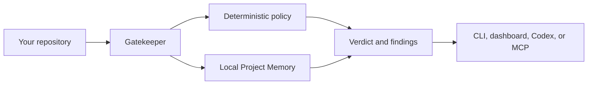

# Gatekeeper

> Understand the project before changing the project.

Gatekeeper is a local-first repository intelligence tool for Codex, contributors, and maintainers. It answers a question ordinary code review often misses: **does this engineering decision belong in this repository, and what evidence supports that conclusion?**

It combines deterministic repository policy with durable Project Memory, then shows the verdict, evidence, and next review step through a CLI, local dashboard, Codex/MCP workflow, and read-only GitHub pull-request review.

## What Gatekeeper does

- Reviews a local worktree, immutable local commit, or GitHub pull request against repository policy.
- Explains `FAST_PATH`, `REQUIRE_CHANGES`, `ESCALATE`, and `BLOCK` with bounded evidence.
- Stores local Project Memory for prior reviews, decisions, selected documentation, and commit history.
- Lets Codex retrieve evidence and complete a review without taking control of the final verdict.
- Keeps `BLOCK` deterministic: model inference can add evidence-supported context or uncertainty, never a hard block.

## Start here

You need [Node.js 24 LTS](https://nodejs.org/), pnpm 11, and Git. `gh` is optional unless you review a live GitHub pull request.

```powershell
git clone https://github.com/xyzbk/gatekeeper.git
cd gatekeeper
pnpm install --frozen-lockfile
pnpm build
```

### Review a repository

Run these commands from the Gatekeeper workspace root. Replace the example path with the repository you want Gatekeeper to inspect.

```powershell
node apps/cli/dist/index.js doctor
node apps/cli/dist/index.js review worktree "C:\path\to\your\repository"
node apps/cli/dist/index.js start "C:\path\to\your\repository"
```

The first command checks your local setup. The second prints a review verdict. The third starts the local dashboard and prints a `127.0.0.1` URL; leave that terminal open while you use the dashboard, then stop it with `Ctrl+C`.

Gatekeeper does not check out branches, stage files, reset Git state, or modify the reviewed repository. Its local SQLite Project Memory is stored in your user app-data directory, outside the repository by default.

## Try the demo before a real repository

Start with the disposable demo repositories in `demo/fixtures`. They let you see Gatekeeper's verdicts without touching your own work.

```powershell
pnpm fixtures:prepare
node apps/cli/dist/index.js review worktree demo/fixtures/clean
node apps/cli/dist/index.js review worktree demo/fixtures/missing-test
node apps/cli/dist/index.js review worktree demo/fixtures/protected-path --format json
```

| Demo repository  | What it demonstrates                      | Expected verdict  |
| ---------------- | ----------------------------------------- | ----------------- |
| `clean`          | A change that satisfies the sample policy | `FAST_PATH`       |
| `missing-test`   | A source change without its related test  | `REQUIRE_CHANGES` |
| `protected-path` | A change to a hard-protected path         | `BLOCK`           |

`pnpm fixtures:prepare` recreates only those disposable fixture directories. Once those results make sense, replace the fixture path with your own repository path in the commands above.

### One-command local evaluation

From a fresh clone with the prerequisites above, run:

```powershell
pnpm judge
```

It installs only the pinned lockfile dependencies, builds the application, runs the six-outcome smoke proof, then starts the interactive demo. On Windows, you can instead double-click [`Judge Gatekeeper Demo.cmd`](Judge%20Gatekeeper%20Demo.cmd); its three visible lines invoke the same command. There is no installer service, downloaded executable, or hidden setup behavior to audit.

### Evaluate the dashboard without an account

If Gatekeeper is already built, start the committed judge demo directly:

```powershell
pnpm demo
```

It creates a temporary local repository, starts a loopback dashboard, and prints its `127.0.0.1` URL. Open that URL, choose **Pull requests**, enter `12`, and select **Review pull request**. The result is an `ESCALATE` verdict with a traceable evidence timeline and remediation. The demo uses committed GitHub-response data: it makes no network request, requires no GitHub account or API key, makes no model call, and never reads your repository. Stop it with `Ctrl+C`; its temporary repository and Project Memory are removed.

This is the quickest evaluation route for Gatekeeper as a local developer tool. The verified desktop platform is Windows; see the [clean install and evaluation guide](docs/release/clean-install-uninstall.md) for prerequisites and the exact fresh-clone path.

## Choose your workflow

| If you want to…                        | Start with…                                                                        |
| -------------------------------------- | ---------------------------------------------------------------------------------- |
| Review current changes                 | [`review worktree`](docs/reference/cli.md#review-worktree-path)                    |
| Review one immutable commit            | [`review commit`](docs/reference/cli.md#review-commit-full-sha-path)               |
| Browse local commits or Project Memory | [`start`](docs/reference/cli.md#start-path) and open the local dashboard           |
| Search earlier decisions and evidence  | [Project Memory commands](docs/reference/cli.md#project-memory)                    |
| Use Gatekeeper from Codex              | [MCP and Codex skill setup](docs/reference/mcp.md#setup)                           |
| Review a GitHub pull request           | [`review pr`](docs/reference/cli.md#review-pr-number-path) with authenticated `gh` |

## Use Gatekeeper with Codex

The Codex integration has four deliberately separate responsibilities:

| Part               | Responsibility                                                                                                                                           |
| ------------------ | -------------------------------------------------------------------------------------------------------------------------------------------------------- |
| Gatekeeper service | Fixes one repository, applies policy, owns Project Memory, and assembles the verdict.                                                                    |
| MCP server         | Gives Codex nine small, typed Gatekeeper tools over the local service. It does not decide verdicts or publish anything.                                  |
| Gatekeeper skill   | Gives Codex the repeatable review sequence: check status, ask before indexing or reasoning, cite returned evidence, then offer remediation.              |
| Codex              | Investigates the supplied evidence and may add `EVIDENCE_SUPPORTED` or `INFERENCE` findings. It cannot create `BLOCK` or replace deterministic findings. |

### One-time setup

Keep the Gatekeeper workspace open as the trusted Codex project; it contains the checked-in [MCP configuration](.codex/config.toml) and [Gatekeeper skill](.agents/skills/gatekeeper/SKILL.md). From that workspace, build Gatekeeper and start it for the repository you want to review:

```powershell
pnpm build
node apps/cli/dist/index.js start "C:\path\to\your\repository"
```

Leave that terminal running. Open `D:\work\gatekeeper` in Codex as a trusted project, then start a new task (or restart Codex) so it discovers the project skill and the local MCP server. Gatekeeper binds the service to the repository path in the command above; MCP tools do not accept a different path or remote later.

### Ask Codex to review efficiently

Mention the skill and give Codex the review boundary in one prompt:

```text
$gatekeeper Review the fixed repository's worktree. First check Gatekeeper status.
If Project Memory is uninitialized or stale, ask me before indexing it. After approval,
index exactly once, review the worktree, and search memory only for a specific follow-up.
Keep deterministic findings separate from evidence-supported conclusions and inferences.
Do not change files or publish anything. Finish with Gatekeeper's persisted verdict and
an optional remediation plan.
```

For a historical commit, ask Codex to list recent commits first and choose the full SHA. For a pull request, explicitly approve the separate read-only GitHub sync and run it from the Gatekeeper workspace using the same target path:

```powershell
node apps/cli/dist/index.js sync github "C:\path\to\your\repository"
```

Then ask Codex to review the PR number. This keeps memory fresh without repeatedly re-indexing, keeps Codex scoped to one repository, and makes every conclusion traceable to returned evidence.

## Built with Codex and GPT-5.6

Gatekeeper was planned, implemented, audited, and iterated in Codex with GPT-5.6. Codex turned the scoped product work into typed contracts, local adapters, fixtures, tests, documentation, and release checks. GPT-5.6 was used to reason through architecture boundaries, policy and safety edge cases, product scope, and review findings before the resulting changes were verified locally.

Those are build-time contributions. At runtime, Gatekeeper's Codex skill and MCP server have the separate, constrained role described above: they retrieve evidence and submit bounded review input, while Gatekeeper preserves deterministic policy and final-verdict authority. The dated Git history records the implementation work; the primary Codex `/feedback` session is included with the Devpost submission.

## How it works



1. Gatekeeper fixes one local repository for the service lifetime.
2. It evaluates bounded change metadata against deterministic policy and retrieves relevant local evidence.
3. It persists a strict review record locally, so a later review can show the evidence chain and compare the result.
4. Codex may add validated evidence-supported findings, but Gatekeeper owns the final verdict.

## Trust and privacy

| Principle                 | What it means                                                                                              |
| ------------------------- | ---------------------------------------------------------------------------------------------------------- |
| Local-first               | No hosted backend or global account is required.                                                           |
| Read-only by default      | Gatekeeper does not mutate the repository or publish to GitHub.                                            |
| Evidence before inference | Repository and GitHub text is untrusted data, never instructions.                                          |
| Deterministic authority   | Only hard deterministic policy findings can produce `BLOCK`.                                               |
| Bounded storage           | Project Memory stores validated metadata and bounded evidence, not full private source files or raw diffs. |

Live GitHub review uses an authenticated `gh` CLI and is read-only. Default tests, the local judge demo, and deterministic workflows do not require GitHub access or an OpenAI key. See the [security overview](docs/security/overview.md) for the full trust model.

## Run the full offline verification

After building, run the reproducible offline judge path:

```powershell
pnpm demo:smoke
pnpm eval
pnpm model-data:dry-run
```

It proves six committed outcomes—including deterministic `BLOCK` and evidence-led `ESCALATE` cases—without a GitHub credential, external network request, or model call. See the [golden evaluation](docs/release/golden-evaluation.md) and [clean install guide](docs/release/clean-install-uninstall.md) for exact platform and release evidence.

## Learn more

- [CLI reference](docs/reference/cli.md)
- [MCP and Codex skill reference](docs/reference/mcp.md)
- [Local API reference](docs/reference/local-api.md)
- [Architecture overview](docs/architecture/overview.md)
- [Verdict and finding reference](docs/reference/verdicts.md)
- [Policy reference](docs/reference/policy.md)
- [Development setup](docs/development/setup.md)

## Contributing

See [CONTRIBUTING.md](CONTRIBUTING.md) for setup, quality gates, review boundaries, and how to propose a change. Please report security concerns through [SECURITY.md](SECURITY.md), not a public issue.

## License

[MIT](LICENSE)
