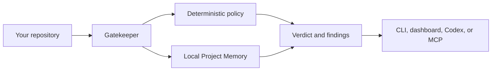

# Gatekeeper

> Understand the project before changing the project.

Gatekeeper is a local-first repository intelligence tool for Codex, contributors, and maintainers. It answers a question ordinary code review often misses: **does this engineering decision belong in this repository, and what evidence supports that conclusion?**

It combines deterministic repository policy with durable Project Memory, then shows the verdict, evidence, and next review step through a CLI, local dashboard, Codex/MCP workflow, and read-only GitHub pull-request review.

## What Gatekeeper does

- Reviews a local worktree, immutable local commit, or GitHub pull request against repository policy.
- Explains `FAST_PATH`, `REQUIRE_CHANGES`, `ESCALATE`, and `BLOCK` with bounded evidence.
- Stores local Project Memory for prior reviews, decisions, selected documentation, and commit history.
- Lets Codex retrieve evidence and complete a review without taking control of the final verdict.
- Keeps `BLOCK` deterministic: model inference can add evidence-supported context or uncertainty, never a hard block.

## Start here

You need [Node.js 24 LTS](https://nodejs.org/), pnpm 11, and Git. `gh` is optional unless you review a live GitHub pull request.

```powershell
git clone https://github.com/xyzbk/gatekeeper.git
cd gatekeeper
pnpm install --frozen-lockfile
pnpm build
```

### Review a repository

Run these commands from the Gatekeeper workspace root. Replace the example path with the repository you want Gatekeeper to inspect.

```powershell
node apps/cli/dist/index.js doctor
node apps/cli/dist/index.js review worktree "C:\path\to\your\repository"
node apps/cli/dist/index.js start "C:\path\to\your\repository"
```

The first command checks your local setup. The second prints a review verdict. The third starts the local dashboard and prints a `127.0.0.1` URL; leave that terminal open while you use the dashboard, then stop it with `Ctrl+C`.

Gatekeeper does not check out branches, stage files, reset Git state, or modify the reviewed repository. Its local SQLite Project Memory is stored in your user app-data directory, outside the repository by default.

## Choose your workflow

| If you want to…                        | Start with…                                                                        |
| -------------------------------------- | ---------------------------------------------------------------------------------- |
| Review current changes                 | [`review worktree`](docs/reference/cli.md#review-worktree-path)                    |
| Review one immutable commit            | [`review commit`](docs/reference/cli.md#review-commit-full-sha-path)               |
| Browse local commits or Project Memory | [`start`](docs/reference/cli.md#start-path) and open the local dashboard           |
| Search earlier decisions and evidence  | [Project Memory commands](docs/reference/cli.md#project-memory)                    |
| Use Gatekeeper from Codex              | [MCP and Codex skill setup](docs/reference/mcp.md#setup)                           |
| Review a GitHub pull request           | [`review pr`](docs/reference/cli.md#review-pr-number-path) with authenticated `gh` |

## How it works



1. Gatekeeper fixes one local repository for the service lifetime.
2. It evaluates bounded change metadata against deterministic policy and retrieves relevant local evidence.
3. It persists a strict review record locally, so a later review can show the evidence chain and compare the result.
4. Codex may add validated evidence-supported findings, but Gatekeeper owns the final verdict.

## Trust and privacy

| Principle                 | What it means                                                                                              |
| ------------------------- | ---------------------------------------------------------------------------------------------------------- |
| Local-first               | No hosted backend or global account is required.                                                           |
| Read-only by default      | Gatekeeper does not mutate the repository or publish to GitHub.                                            |
| Evidence before inference | Repository and GitHub text is untrusted data, never instructions.                                          |
| Deterministic authority   | Only hard deterministic policy findings can produce `BLOCK`.                                               |
| Bounded storage           | Project Memory stores validated metadata and bounded evidence, not full private source files or raw diffs. |

Live GitHub review uses an authenticated `gh` CLI and is read-only. Default tests, the local judge demo, and deterministic workflows do not require GitHub access or an OpenAI key. See the [security overview](docs/security/overview.md) for the full trust model.

## Try the local proof

After building, run the reproducible offline judge path:

```powershell
pnpm demo:smoke
pnpm eval
pnpm model-data:dry-run
```

It proves six committed outcomes—including deterministic `BLOCK` and evidence-led `ESCALATE` cases—without a GitHub credential, external network request, or model call. See the [golden evaluation](docs/release/golden-evaluation.md) and [clean install guide](docs/release/clean-install-uninstall.md) for exact platform and release evidence.

## Learn more

- [CLI reference](docs/reference/cli.md)
- [MCP and Codex skill reference](docs/reference/mcp.md)
- [Local API reference](docs/reference/local-api.md)
- [Architecture overview](docs/architecture/overview.md)
- [Verdict and finding reference](docs/reference/verdicts.md)
- [Policy reference](docs/reference/policy.md)
- [Development setup](docs/development/setup.md)
- [Build progress and verification record](docs/progress.md)

## Contributing

See [CONTRIBUTING.md](CONTRIBUTING.md) for setup, quality gates, review boundaries, and how to propose a change. Please report security concerns through [SECURITY.md](SECURITY.md), not a public issue.

## License

[MIT](LICENSE)
